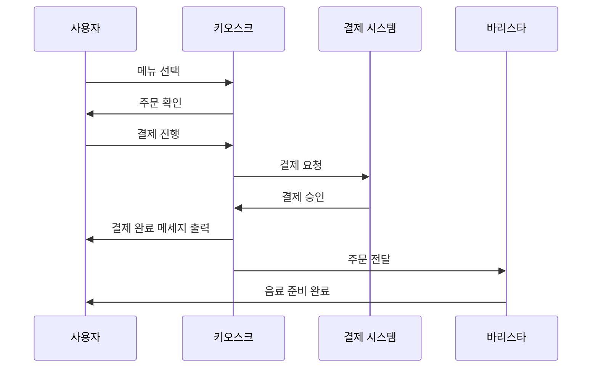

# Cafe Kiosk

일상 속 소프트웨어로 카페 키오스크의 진행 과정을 선택하였습니다.

해당 소프트웨어 진행 과정에 참여하는 객체들은 고객, 키오스크, 결제 시스템, 바리스타로 총 4개의 객체로 구성되어 있습니다.

---

## 시퀀스 다이어그램



---

## Java 코드 구현

### User.java

```java
import java.util.Scanner;

class User {
    private String name;

    public User(String name) {
        this.name = name;
    }

    public void chooseMenu(Kiosk kiosk) {
        Scanner scanner = new Scanner(System.in);
        System.out.print(name + " 메뉴를 선택하세요: ");
        String menu = scanner.nextLine();
        kiosk.confirmOrder(this, menu);
    }

    public void receiveDrink(String drink) {
        System.out.println(name + " 사용자가 음료를 받았습니다: " + drink);
    }
}
```

### Kiosk.java

```java
class Kiosk {
    private PaymentSystem paymentSystem;
    private Barista barista;

    public Kiosk(PaymentSystem paymentSystem, Barista barista) {
        this.paymentSystem = paymentSystem;
        this.barista = barista;
    }

    public void confirmOrder(User user, String menu) {
        System.out.println("주문을 확인합니다: " + menu);
        processPayment(user, menu);
    }

    private void processPayment(User user, String menu) {
        System.out.println("결제를 진행합니다.");
        boolean paymentApproved = paymentSystem.processPayment();
        if (paymentApproved) {
            System.out.println("결제 완료.");
            sendOrderToBarista(user, menu);
        } else {
            System.out.println("결제 실패. 주문 취소.");
        }
    }

    private void sendOrderToBarista(User user, String menu) {
        System.out.println("키오스크가 바리스타에게 주문을 전달합니다: " + menu);
        barista.prepareDrink(user, menu);
    }
}
```

### PaymentSystem.java

```java
class PaymentSystem {
    public boolean processPayment() {
        System.out.println("결제 시스템이 결제를 승인합니다.");
        return true;
    }
}
```

### Barista.java

```java
class Barista {
    public void prepareDrink(User user, String menu) {
        System.out.println("바리스타가 음료를 준비합니다: " + menu);
        user.receiveDrink(menu);
    }
}
```

### Main.java

```java
import java.util.Scanner;

public class Main {
    public static void main(String[] args) {
        Scanner scanner = new Scanner(System.in);
        PaymentSystem paymentSystem = new PaymentSystem();
        Barista barista = new Barista();
        Kiosk kiosk = new Kiosk(paymentSystem, barista);

        System.out.print("사용자 이름을 입력하세요: ");
        String userName = scanner.next();
        User user = new User(userName);

        while (true) {
            user.chooseMenu(kiosk);
            System.out.print("추가 주문을 하시겠습니까? (yes/no): ");
            String answer = scanner.next();
            if (!answer.equalsIgnoreCase("yes")) break;
        }

        System.out.println("프로그램 종료.");
        scanner.close();
    }
}
```

---

## 응집도,결합도 평가

각 클래스들은 일부 상호작용이 있긴 하지만 과하지 않게 상호작용 하며 각 클래스 별로 담당한 부분이 착실히 구분,실행되고 있으므로 결합도는 낮고 응집도는 높다고 볼 수 있다.
